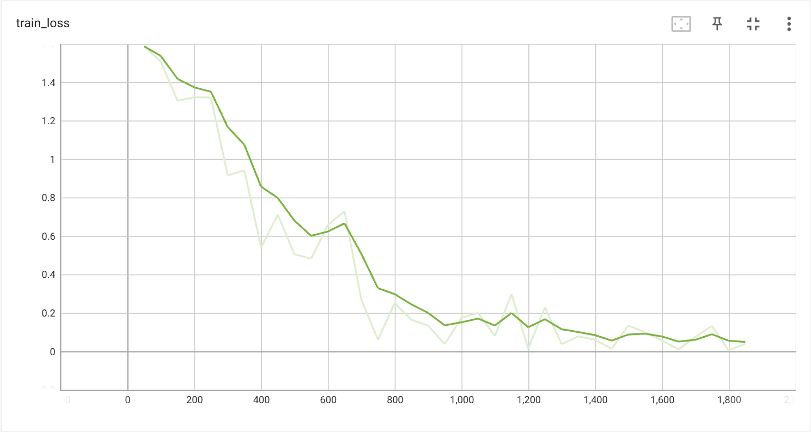
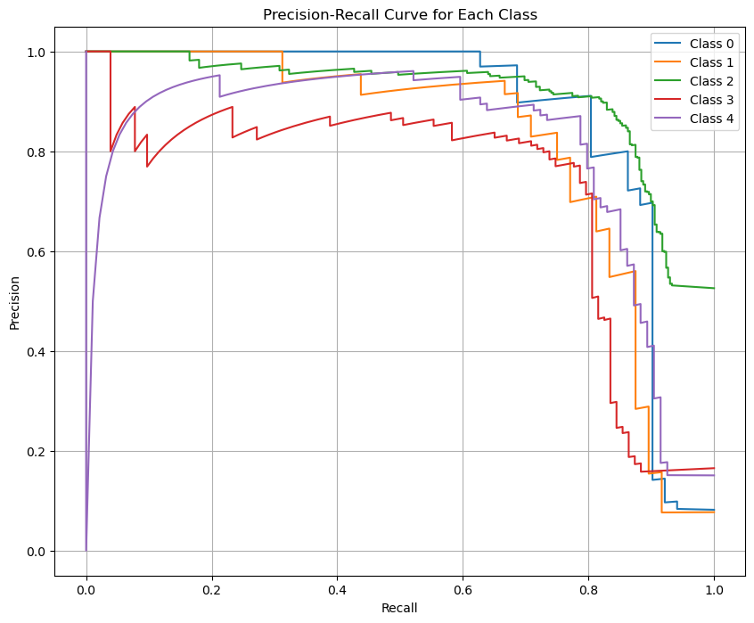

# Tiny-VOC图像分类
## 传统模型
分别测试lenet、resnet-18、vgg以及vit模型在tiny-voc数据集上的准确度，结果如下所示：
|   模型    | Accuracy |
| :-------: | :----: |
|   lenet   |  65.9% |
| resnet-18 | 85.4%  |
|    VGG    | 89.4%  |
|    VIT    | 68.59% |
# lenet

训练过程中的loss以及accuracy如下图所示：

最终测试结果：
| Class | Precision | Recall | F1-Score | Support |
|-------|-----------|--------|----------|---------|
| 0     | 0.760     | 0.792  | 0.776    | 48      |
| 1     | 0.491     | 0.540  | 0.514    | 50      |
| 2     | 0.797     | 0.668  | 0.726    | 346     |
| 3     | 0.592     | 0.689  | 0.637    | 103     |
| 4     | 0.404     | 0.571  | 0.473    | 77      |
| **Accuracy** |           |        | 0.659    | 624     |
| **Macro avg** | 0.609     | 0.652  | 0.625    | 624     |
| **Weighted avg** | 0.687     | 0.659  | 0.667    | 624     |

PR曲线：

# resnet-18

训练过程中的loss以及accuracy如下图所示：

最终测试结果：
| Class | Precision | Recall | F1-Score | Support |
|-------|-----------|--------|----------|---------|
| 0     | 0.953     | 0.872  | 0.911    | 47      |
| 1     | 0.857     | 0.698  | 0.769    | 43      |
| 2     | 0.846     | 0.933  | 0.887    | 341     |
| 3     | 0.880     | 0.854  | 0.867    | 103     |
| 4     | 0.800     | 0.622  | 0.700    | 90      |
| **Accuracy** |           |        | 0.854    | 624     |
| **Macro avg** | 0.867     | 0.796  | 0.827    | 624     |
| **Weighted avg** | 0.854     | 0.854  | 0.850    | 624     |

PR曲线：

# vgg

训练过程中的loss以及accuracy如下图所示(由于vgg训练较慢，因而在训练过程中并没有像之前两个模型一样一次训练到底，而是每次只训练一个较小的epochs，保存相应checkpoints，并根据loss和accuracy判断是否需要更改参数，图中不同曲线为同一训练过程中的不同阶段）：

最终测试结果：
| Class | Precision | Recall | F1-Score | Support |
|-------|-----------|--------|----------|---------|
| 0     | 0.891     | 0.961  | 0.925    | 51      |
| 1     | 0.870     | 0.833  | 0.851    | 48      |
| 2     | 0.942     | 0.887  | 0.914    | 328     |
| 3     | 0.929     | 0.893  | 0.911    | 103     |
| 4     | 0.748     | 0.915  | 0.823    | 94      |
| **Accuracy** |           |        | 0.894    | 624     |
| **Macro avg** | 0.876     | 0.898  | 0.885    | 624     |
| **Weighted avg** | 0.901     | 0.894  | 0.896    | 624     |

PR曲线：

# vit
训练集以及测试集的loss以及accuracy如下图所示：

- 总结：四种模型中resnet-18以及vgg综合表现良好，lenet模型由于结构较为简单，虽然在训练集上能够达到较好的效果，然而泛化能力较差，在测试集上表现不佳；而vit可能由于结构较为复杂，训练集较少，训练过程中loss与accuracy振荡显著，难以达到收敛，同时准确率也不如传统模型resent-18，vgg。
# vim&vig
分别测试vim及vig模型在tiny-voc数据集上的准确度，结果如下所示：
|   模型    | Accuracy |
| :-------: | :----: |
|   vim   |  68.43% |
| vig | 71.79%  |
|    vig_ema    | 69.07%  |

